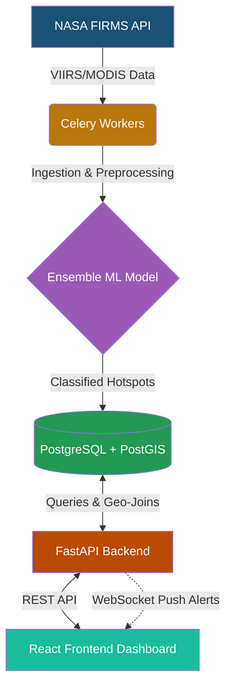

<div align="center">
  
  
  
  
  <br />
  <br />

  <h1>🔥 IGNIS</h1>
  <h3>Intelligent Geospatial Network for Industrial fire Surveillance</h3>
  <p>An AI-powered geospatial platform leveraging NASA FIRMS data to detect, classify, and monitor industrial fires in real-time.</p>
</div>

---

## 📖 Overview

**IGNIS** is a comprehensive solution developed for the **Smart India Hackathon (SIH) 2024**. The system autonomously ingests VIIRS/MODIS satellite data from NASA FIRMS, enriches it with geospatial context (OSM facilities, land cover), and applies an ensemble Machine Learning model to accurately differentiate true **Industrial Fires** from forest fires, agricultural fires, and static thermal anomalies.

When a critical industrial fire is detected, IGNIS triggers real-time WebSocket alerts to a state-of-the-art React dashboard, allowing field operators to view, acknowledge, and resolve incidents instantly.

## ✨ Key Features

- 🛰️ **Automated NASA FIRMS Ingestion**: Celery workers fetch live satellite anomaly data.
- 🧠 **AI Classification Engine**: Ensemble ML model (Random Forest, XGBoost, LightGBM) trained on historical thermal profiles.
- 🗺️ **Geospatial Intelligence**: PostGIS integration for mapping hotspots against industrial infrastructure buffers.
- ⚡ **Real-Time WebSocket Alerts**: Instant push notifications for critical industrial fire detections.
- 📊 **Dynamic Glassmorphism Dashboard**: A visually stunning UI featuring interactive maps, timeline charts, and alert management.
- 🕵️ **Human-in-the-loop Verification**: Feedback mechanism for ground truth updating.

## 🛠️ Tech Stack

### Frontend
- **React.js + Vite**
- **Leaflet.js** for interactive CartoDB mapping
- **Chart.js** for analytics and time-series data
- **Vanilla CSS** with a custom Glassmorphism Dark Theme

### Backend & AI
- **FastAPI** (High-performance async API)
- **Python Data Stack** (`pandas`, `scikit-learn`, `xgboost`, `lightgbm`)
- **Celery & Redis** (Background task scheduling)

### Database
- **PostgreSQL + PostGIS** (Spatial data processing)
- **SQLAlchemy + GeoAlchemy2** (ORM)

---

## 🏗️ Architecture



---

## 🚀 Local Setup Instructions

Follow these steps to run the IGNIS platform locally for demonstration purposes.

### 1. Backend Setup

Open a terminal and navigate to the `backend` directory:

```bash
cd backend

# Create a virtual environment
python -m venv venv
venv\Scripts\activate  # On Windows

# Install dependencies
pip install -r requirements.txt

# Start the FastAPI Server
uvicorn app.main:app --reload --port 8000
```
> **Note:** For local mock testing, the API includes Mock Auth and Report generation endpoints so a live PostgreSQL database is not strictly required to launch the UI.

### 2. Frontend Setup

Open a new terminal and navigate to the `frontend` directory:

```bash
cd frontend

# Install Node modules
npm install

# Start the Vite Development Server
npm run dev
```

Visit `http://localhost:5173` in your browser to interact with the IGNIS Dashboard.

---

## 📚 API Documentation

Once the backend is running, you can explore the fully interactive Swagger UI documentation generated automatically by FastAPI:

* **Swagger UI:** [http://localhost:8000/docs](http://localhost:8000/docs)
* **ReDoc:** [http://localhost:8000/redoc](http://localhost:8000/redoc)

---

<div align="center">
  <i>Built with ❤️ for Smart India Hackathon 2024</i>
</div>
