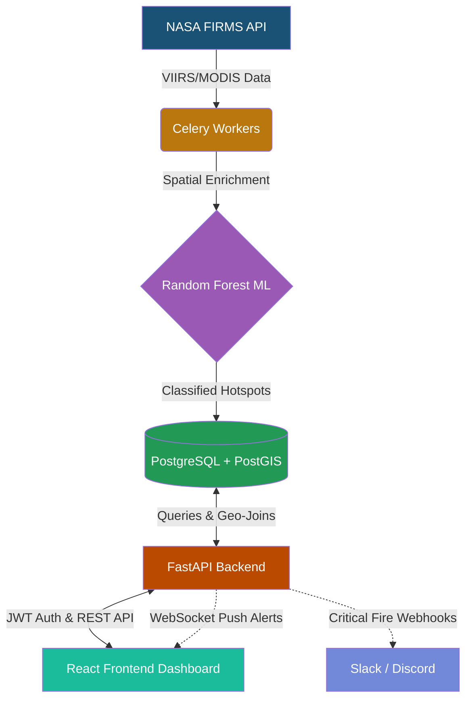

<div align="center">
  
  
  
  
  
  
  <br />
  <br />

  <h1>🔥 IGNIS</h1>
  <h3>Intelligent Geospatial Network for Industrial fire Surveillance</h3>
  <p>An AI-powered geospatial platform leveraging NASA FIRMS data to detect, classify, and monitor industrial fires in real-time.</p>
</div>

---

## 📖 Overview

**IGNIS** is a comprehensive solution developed for **Smart India Hackathon (SIH) 2026** — Problem Statement **26162** (NTRO, Ministry of PMO). The system autonomously ingests VIIRS/MODIS satellite data from NASA FIRMS, enriches it with geospatial context (OSM facilities, land cover), and applies a trained **Random Forest Machine Learning model** to accurately differentiate true **Industrial Fires** from forest fires, agricultural fires, and static thermal anomalies.

When a critical industrial fire is detected, IGNIS triggers real-time WebSocket alerts to a state-of-the-art React dashboard, allowing field operators to view, acknowledge, and resolve incidents instantly, while simultaneously pinging external emergency webhooks (Slack/Discord).

## ✨ Key Features

- 🛰️ **Automated NASA FIRMS Ingestion**: Celery workers fetch live satellite anomaly data every 10 minutes.
- 🧠 **AI Classification Engine**: A `scikit-learn` Random Forest Soft-Voting Classifier trained on 10,000+ historical thermal profiles.
- 🗺️ **Geospatial Intelligence**: PostGIS integration for mapping hotspots against industrial infrastructure buffers.
- ⚡ **Real-Time Alerting**: Instant WebSocket push notifications and external Webhook dispatch (Slack/Discord) for CRITICAL industrial fire detections.
- 🔒 **Secure Authentication**: JWT-based OAuth2 secure login and registration system.
- 📊 **Dynamic Glassmorphism Dashboard**: A visually stunning UI featuring interactive maps, timeline charts, and tactical intelligence screens.

## 🛠️ Tech Stack

### Frontend
- **React.js + Vite**
- **Framer Motion** for tactical HUD animations
- **Leaflet.js** for interactive CartoDB mapping
- **Chart.js** for analytics and time-series data
- **Vanilla CSS** with a custom Glassmorphism Dark Theme

### Backend & AI
- **FastAPI** (High-performance async API)
- **Python Data Stack** (`pandas`, `scikit-learn`, `numpy`)
- **Celery & Redis** (Background task scheduling & Ingestion)

### Database
- **PostgreSQL + PostGIS** (Spatial data processing)
- **SQLAlchemy + GeoAlchemy2** (ORM)

---

## 🏗️ Architecture



---

## 🚀 1-Click Deployment (Jury Ready)

To make testing incredibly simple for SIH Judges, the entire application has been containerized and pre-configured. **Zero manual setup is required.**

### Prerequisites
- [Docker](https://www.docker.com/) and Docker Compose installed on your system.

### Step 1: Boot the Platform
Open your terminal in the project root directory and run:

```bash
docker-compose up -d --build
```
*Note: The first build may take ~2 minutes to compile heavy geospatial libraries (GDAL, GeoPandas).*

### Step 2: Access the Application
- Open your browser and navigate to: **http://localhost:5173**
- The backend automatically pre-seeds the database and API keys on boot!

### Step 3: Login
Use the default administrator credentials:
- **Email:** `admin@ignis.gov`
- **Password:** `admin123`

### Step 4: Test the Live Pipeline
1. Navigate to the **Settings** page via the sidebar.
2. Click **"FORCE IMMEDIATE SYNC"**.
3. IGNIS will immediately fetch the latest global telemetry from NASA, run it through the Machine Learning inference engine, and populate the map!

---

## 🛑 Troubleshooting

- **No data appearing on the map?** Ensure you hit the "Force Immediate Sync" button in Settings. NASA satellites only pass over intermittently, so live data updates naturally every few hours.
- **Backend logs:** To see the ML engine making predictions in real-time, run `docker logs -f ignis-worker`.
